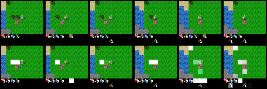
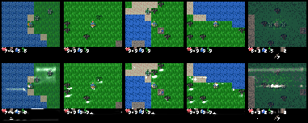

<h1>Learning to Generalize with Object-centric Agents in the Open World Survival Game Crafter</h1>

<div align="center">
  <a href="https://astanic.github.io/" target="_blank">Aleksandar&nbsp;Stanić</a> &emsp;
  <a href="https://twitter.com/yujin_tang" target="_blank">Yujin&nbsp;Tang</a> &emsp;
  <a href="https://twitter.com/hardmaru" target="_blank">David&nbsp;Ha</a> &emsp;
  <a href="https://people.idsia.ch/~juergen/" target="_blank">Jürgen&nbsp;M.&nbsp;Schmidhuber</a>
</div>
<br>
<br>

Paper link: TODO

<div align="center">

</div>

Example of Crafter gameplay and object-centric agent's attention visualizations
</div>

### Reproducing the experiments from the paper

To install all the requirements use:

``` bash
pip install -r requirements.txt
```

To reproduce numbers from Table 1 for all the agents run the following commands:

``` bash
python3 main.py --profile=ppo_cnn
python3 main.py --profile=ppo_spcnn
python3 main.py --profile=lstm_cnn
python3 main.py --profile=lstm_spcnn
python3 main.py --profile=oc_sa
python3 main.py --profile=oc_ca
```

For a run without the scoreboard rendered run:

``` bash
python3 main.py --profile=ppo_cnn -crf.render_scoreboard=False
```

To evaluate a PPO CNN agent (change `profile` argument for other agents) in different CrafterOODapp environments (Table 4) run the commands shown below.
Explanation: the comma-separated string contains four numbers, representing the probablities of each of the four object variants appearing in the map.
For example, 88,4,4,4 means that the first object variant appears with 88% probability, and all the other objects with 4% probability.
Note that the validation environment always contains only the last three object, with equal likelihood of appearance.
``` bash
python3 main.py --profile=ppo_cnn --el_vars=tczsuk --el_freq_train=25,25,25,25 --el_freq_valid=0,33,33,34
python3 main.py --profile=ppo_cnn --el_vars=tczsuk --el_freq_train=52,16,16,16 --el_freq_valid=0,33,33,34
python3 main.py --profile=ppo_cnn --el_vars=tczsuk --el_freq_train=76,8,8,8 --el_freq_valid=0,33,33,34
python3 main.py --profile=ppo_cnn --el_vars=tczsuk --el_freq_train=88,4,4,4 --el_freq_valid=0,33,33,34
python3 main.py --profile=ppo_cnn --el_vars=tczsuk --el_freq_train=94,2,2,2 --el_freq_valid=0,33,33,34
python3 main.py --profile=ppo_cnn --el_vars=tczsuk --el_freq_train=97,1,1,1 --el_freq_valid=0,33,33,34
python3 main.py --profile=ppo_cnn --el_vars=tczsuk --el_freq_train=100,0,0,0 --el_freq_valid=0,33,33,34
```

To evaluate a PPO CNN agent (change profile argument for other agents) in different CrafterOODnum environments (Table 6) run the commands shown below.

``` bash
python3 main.py --profile=ppo_cnn -el_app_freq_train=easyX2 --el_ap_freq_valid=default
python3 main.py --profile=ppo_cnn -el_app_freq_train=easyX4 --el_ap_freq_valid=default
python3 main.py --profile=ppo_cnn -el_app_freq_train=mix --el_ap_freq_valid=default
python3 main.py --profile=ppo_cnn -el_app_freq_train=default --el_ap_freq_valid=mix
python3 main.py --profile=ppo_cnn -el_app_freq_train=default --el_ap_freq_valid=easyX2
python3 main.py --profile=ppo_cnn -el_app_freq_train=default --el_ap_freq_valid=easyX4
python3 main.py --profile=ppo_cnn -el_app_freq_train=easyX2 --el_ap_freq_valid=hardX2
python3 main.py --profile=ppo_cnn -el_app_freq_train=easyX4 --el_ap_freq_valid=hardX4
```

Additionally, it is possible to have a fine-grained control over the generation of individual elements, namely trees, coal, cows, zombies and skeleton.
To achieve this, use a string of length 5 (each char for each of the objects previously mentioned, in that order(!)).
The string specifies the number of objects - `f`=4x, `d`=2x, `s`=1x, `h`=1/2, `q`=1/4 relative to their number in the default environment.
The 5-length string specifies the relative increase (f,d) or decrease (h,q) in the number of following objects: tree, coal, cow, zombie, skeleton (in this exact order).
For example, using `easyX2` is equivalent to using the `dddhh` string.

``` bash
python3 main.py --profile=ppo_cnn -el_app_freq_train=dddhh --el_ap_freq_valid=sssss  # easy(x2) -> default
python3 main.py --profile=ppo_cnn -el_app_freq_train=fffqq --el_ap_freq_valid=sssss  # easy(x4) -> default
python3 main.py --profile=ppo_cnn -el_app_freq_train=fffff --el_ap_freq_valid=sssss  # mix(x4)  -> default
python3 main.py --profile=ppo_cnn -el_app_freq_train=sssss --el_ap_freq_valid=fffff  # default  -> mix
python3 main.py --profile=ppo_cnn -el_app_freq_train=sssss --el_ap_freq_valid=dddhh  # default  -> easy(x2)
python3 main.py --profile=ppo_cnn -el_app_freq_train=sssss --el_ap_freq_valid=fffqq  # default  -> easy(x4)
python3 main.py --profile=ppo_cnn -el_app_freq_train=dddhh --el_ap_freq_valid=hhhdd  # easy(x2) -> hard(x2)
python3 main.py --profile=ppo_cnn -el_app_freq_train=fffqq --el_ap_freq_valid=qqqff  # easy(x4) -> hard(x4)
```

### Citation

Please cite our paper if you use our code or if you re-implement our method:

```
@article{stanic2022learning,
  title = {Learning to Generalize with Object-centric Agents in the Open World Survival Game Crafter},
  author = {Stani\'{c}, Aleksandar and Tang, Yujin and Ha, David and Schmidhuber, J{\"u}rgen},
  year = {2022},
}
```
